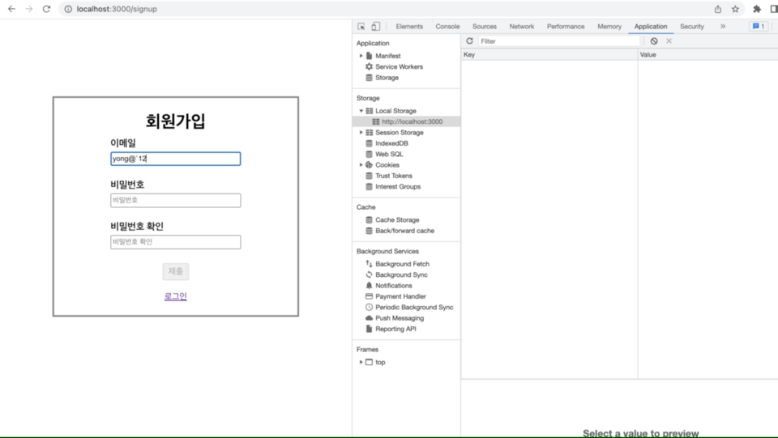
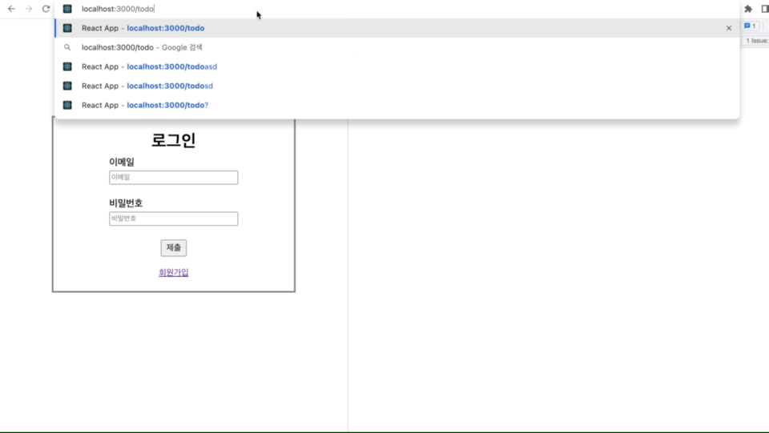
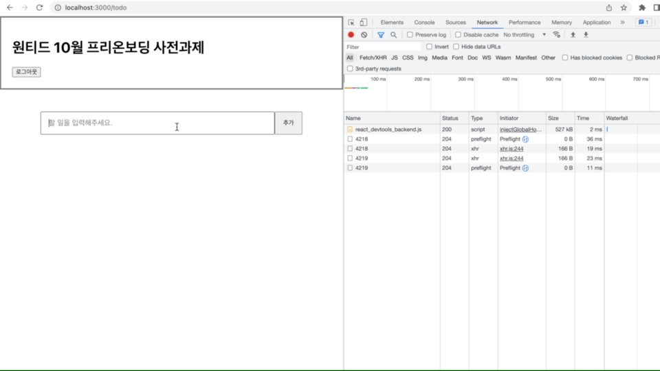

# 2022 10월 원티드 프리온보딩 사전과제

### [🚀🚀🚀 배포링크(클릭) 🚀🚀🚀](https://classy-bonbon-d8cd7d.netlify.app/)

[](https://app.netlify.com/sites/classy-bonbon-d8cd7d/deploys)

---

1. [간단 데모 gif](#1)
2. [프로젝트 실행방법](#2)
3. [주요 기술 스택](#3)
4. [공통 요구 사항](#4)
5. [기능 요구 사항](#5)
6. [폴더 구조](#6)

---

<h2 id="1">👀 간단 데모 gif</h2>

### 회원가입 폼



### 로그인 폼



### 투두리스트



---

<h2 id="2">🚀 프로젝트 실행방법</h2>

1. 이 레포지토리를 clone하고 의존성을 설치해주세요.

- 클론 후 `npm install`

2. 로컬 환경에서 실행하기

- `npm start`

---

<h2 id="3">🛠 주요 기술 스택</h2>

- npm `v8.11.0`
- typescript
- react (CRA)
- react-router-dom v6 `v6.4.2`
- styled-components
- eslint, prettier

---

<h2 id="4">📝 공통 요구사항</h2>

> ✔️ 공통 요구사항을 모두 만족시켰습니다.

- [x] CRA 사용
- [x] 함수 컴포넌트 사용
- [x] 자연스럽고 적당한 UI/UX 고려
- [x] 리드미 작성
- [x] 프로젝트 실행방법
- [x] 데모영상 및 배포

---

<h2 id="5">✅ 기능 요구사항</h2>

> ✔️ 필수 구현사항을 모두 구현했습니다.
> 필수 구현사항 외에도 추가적으로 구현한 기능들이 몇 가지 있습니다.

## Assignment1. 폼

- [x] / 경로에 로그인 / 회원가입 기능을 개발해주세요.
- [x] 페이지 안에 이메일 입력창, 비밀번호 입력창, 제출 버튼이 포함된 형태로 구성해주세요.
- [x] 별도 경로로 분리해서 구현
- [x] 이메일에는 `@`가 포함되어야 한다.
- [x] 비밀번호는 8자리 이상이어야 한다.
- [x] 입력된 이메일과 비밀번호가 위 조건을 만족할 때만 버튼이 활성화 되도록 해주세요.

**💡 추가적으로 구현한 부분**

- [x] 필드가 유효하지 않다면 필드 아래에 에러 메세지를 띄운다.

## Assignment2. 네트워크 통신, 인증

- [x] "로그인" 시 올바른 응답을 받았다면 `/todo` 경로로 이동
- [x] "로그인" 시 서버에서 JWT를 받으면 로컬 스토리지에 저장한다.

**💡 추가적으로 구현한 부분**

- [x] 로그인, 회원가입 시 200번대가 아닌 응답이 발생하면 사용자에게 피드백을 한다.

## Assignment3. 인증과 리다이렉트

- [x] 로컬 스토리지에 토큰이 있는 상태로 / 페이지에 접속한다면 /todo 경로로 리다이렉트 시켜주세요.
- [x] 로컬 스토리지에 토큰이 없는 상태로 /todo페이지에 접속한다면 / 경로로 리다이렉트 시켜주세요.

**💡 추가적으로 구현한 부분**

- [x] 로그아웃 기능

## Assignment4. 투두리스트 UI

- [x] /todo경로에 접속하면 투두 리스트의 목록을 볼 수 있도록 해주세요
- [x] 리스트 페이지에는 투두 리스트의 내용과 완료 여부가 표시되어야 합니다.
- [x] 리스트 페이지에는 입력창과 추가 버튼이 있고, 추가 버튼을 누르면 입력창의 내용이 새로운 투두 리스트로 추가되도록 해주세요

## Assignment5. 투두리스트 기능

- [x] 투두 리스트의 수정, 삭제 기능을 구현해주세요
- [x] 투두 리스트의 개별 아이템 우측에 수정버튼이 존재하고 해당 버튼을 누르면 수정모드가 활성화되고 투두 리스트의 내용을 수정할 수 있도록 해주세요
- [x] 수정모드에서는 개별 아이템의 우측에 제출버튼과 취소버튼이 표시되며 해당 버튼을 통해서 수정 내용을 제출하거나 수정을 취소할 수 있도록 해주세요
- [x] 투두 리스트의 개별 아이템 우측에 삭제버튼이 존재하고 해당 버튼을 누르면 투두 리스트가 삭제되도록 해주세요

**💡 추가적으로 구현한 부분**

- [x] 토글 기능에 대한 네트워크 통신 최적화
  - 토글 기능 같은 경우, 빠르게 반복적으로 토글버튼을 누르면 필요없는 네트워크 요청이 발생할 수도 있습니다. 따라서 토글버튼에 디바운스를 적용하여 그 사이에 태스크 큐에 네트워크 요청을 담아뒀다가 네트워크 요청을 할 필요가 없는 경우(토글을 눌렀다가 또 토글을 누르는 경우)에는 네트워크 요청을 하지 않도록 최적화를 했습니다.

---

<h2 id="6">🗂 폴더 구조</h2>

<details>
<summary>폴더 구조</summary>
<div markdown="1">

```
src
 ┣ components
 ┃ ┣ Todo
 ┃ ┃ ┣ TodoForm.tsx
 ┃ ┃ ┣ TodoItem.tsx
 ┃ ┃ ┣ TodoList.tsx
 ┃ ┃ ┗ index.ts
 ┃ ┗ auth
 ┃ ┃ ┣ AuthFormField.tsx
 ┃ ┃ ┣ AuthFormTemplate.tsx
 ┃ ┃ ┣ ErrorText.tsx
 ┃ ┃ ┣ LoginForm.tsx
 ┃ ┃ ┣ SignupForm.tsx
 ┃ ┃ ┗ index.ts
 ┣ lib
 ┃ ┣ api
 ┃ ┃ ┣ auth.ts
 ┃ ┃ ┗ todo.ts
 ┃ ┣ contexts
 ┃ ┃ ┗ auth.tsx
 ┃ ┣ core
 ┃ ┃ ┗ api.ts
 ┃ ┣ models
 ┃ ┃ ┗ todo.ts
 ┃ ┗ utils
 ┃ ┃ ┣ debounce.ts
 ┃ ┃ ┗ tokenStorage.ts
 ┣ modules
 ┃ ┗ todoManager.ts
 ┣ pages
 ┃ ┣ LoginPage.tsx
 ┃ ┣ SignupPage.tsx
 ┃ ┣ TodoPage.tsx
 ┃ ┗ index.ts
 ┣ App.css
 ┣ App.test.tsx
 ┣ App.tsx
 ┣ index.css
 ┣ index.tsx
 ┣ react-app-env.d.ts
 ┣ reportWebVitals.ts
 ┗ setupTests.ts
```

</div>
</details>
